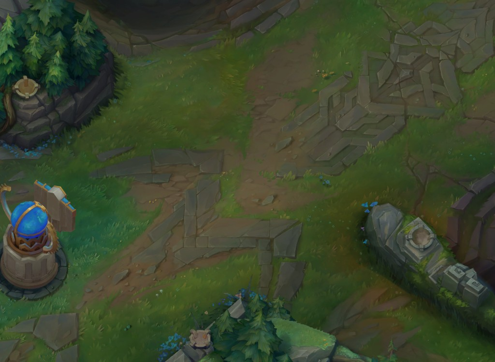
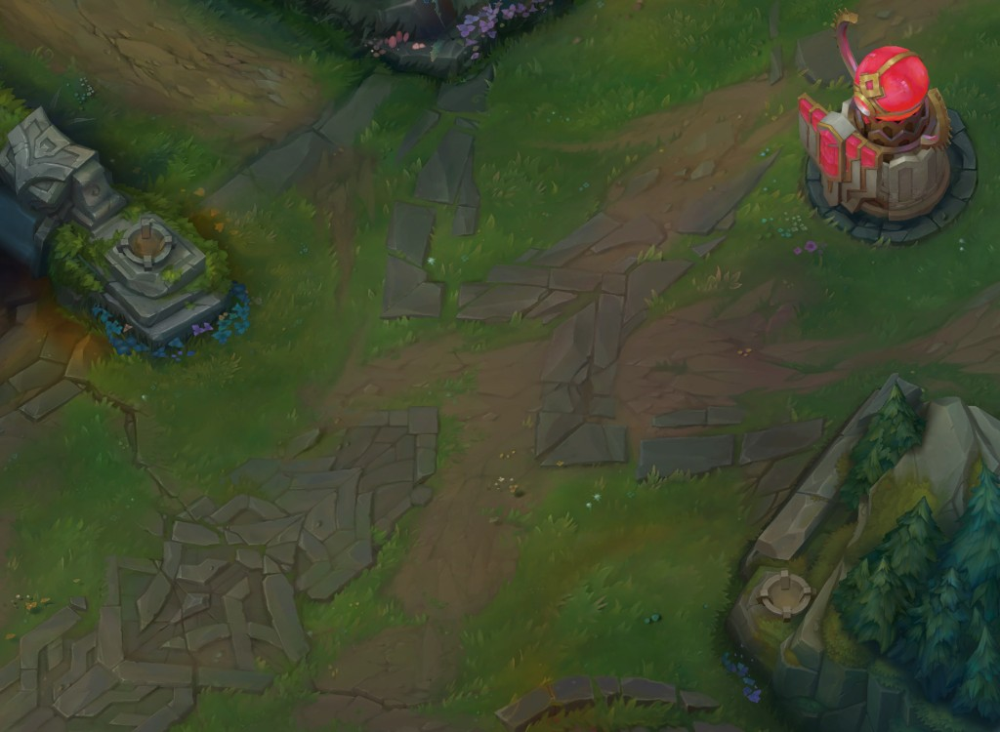

# Show Me Skins

Browse and view League of Legends champion skins in 3D.

Live site: [showmeskins.lol](https://showmeskins.lol)

## Images


| Blue Side | Red Side |
| --- | --- |
|  |  |

## Features

- Browse all champions and skins
- View skins in an interactive 3D model viewer
- Deep links for champion/skin URLs
- Companion integration for live and post-game views

## Local Development

```bash
npm install
npm run dev
```

App runs locally at `http://localhost:5173`.

## Build

```bash
npm run build
npm run preview
```

## Asset Sync (Vercel Blob)

You can mirror CDN-heavy assets to your own Blob store to improve reliability:

```bash
npm run sync-chromas
npm run sync-art
```

Required environment variable:

- `BLOB_READ_WRITE_TOKEN` (Vercel Blob read/write token)

Optional runtime variables:

- `VITE_BLOB_BASE_URL` for chroma textures
- `VITE_ASSET_BASE_URL` for splash/loading preview art

## Tech

- React + TypeScript + Vite
- Three.js (`@react-three/fiber`, `@react-three/drei`)
